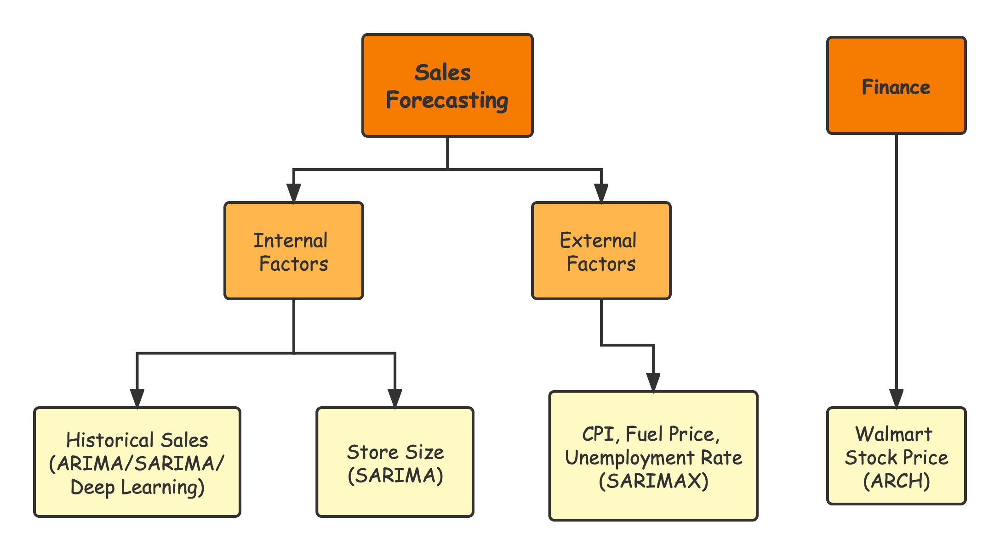

# Sales Forecasting Using Time Series Analysis

## Topic

The topic of this study is about sales forecasting. This website will mainly use different models of time series to study the feasibility and methods of sales forecasting and try to forecast based on sales data of Walmart.

## Interpretation

Sales forecasting is the process to predict a company's future sales. It is crucial for every company because the forecasting provides for companies with ideas about how to make sales plans, how to make new investments, as well as how to arrange their stocks. Accurate sales forecasting can undoubtedly bring tangible benefits for a company. However, it is always difficult to predict the future sales due to multiple factors that we need to consider. External factors include population, market environment, economic situation, policy from government, and industry competition. Internal factors involve a company's sales strategy, product type, production resources, etc. In order to accurately predict the future sales, a model need to take many of these important factors into consideration. 

## "Big Picture" of This Study

In this project, I will consider both internal and external factors about sales forecasting of Walmart. For the internal factors, the most important and fundamental part is the historical sales, which is a time series that contains sales information over a period of time. By using models like ARIMA or SARIMA, we can capture the data patterns within the historical sales. Also, I will consider the store size of Walmart as another internal factor, because stores with different sizes may have different production and sales strategies. As for external factors, CPI index, fuel price, unemployment and temperature will be taken into consideration. In this part, I will try to use a SARIMAX model to figure out the significance and effect of these features. Besides, as a supplement to this project, I will also utilize a financial time series model to study the stock price of Walmart.

## Data Science Questions

**There are 10 questions highly related to my topic which will be answered by this project:**

- Does Walmart sales data contain significant trend or seasonal fluctuations?

- Are we able to use time series models to accurately predict the future sales?

- For sales data of different stores, are we able to use similar models to fit the data?

- Is there a significant difference in sales between holidays and non-holidays?

- Which model has the highest accuracy for forecasting the sales data?

- Can deep learning algorithms enhance the performance of time series models?

- Is there relationship between the sales data and stock price of Walmart?

- Does overall economic environment affect the sales?

- Which features have significant influence on the sales of Walmart stores?

- What is the main limitation or difficulty for sales forecasting using time series models?
